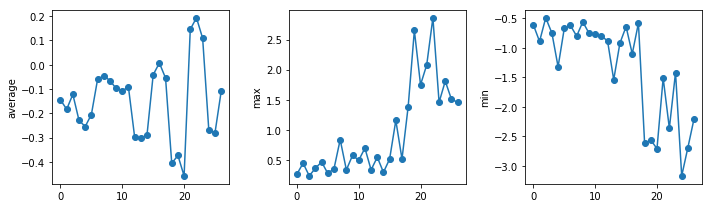
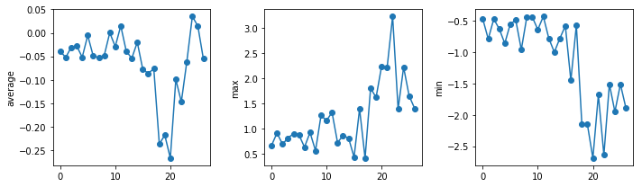
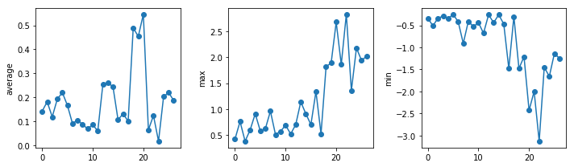

We now have almost everything we need to process all our data files.
The only thing that's missing is a library with a rather unpleasant name:

~~~
import glob
~~~
{: .language-python}

The `glob` library contains a function, also called `glob`,
that finds files and directories whose names match a pattern.
We provide those patterns as strings:
the character `*` matches zero or more characters,
while `?` matches any one character.
We can use this to get the names of all the CSV files in the current directory:

~~~
print(glob.glob('uahncdc.lt-*.csv'))
~~~
{: .language-python}

~~~
['uahncdc.lt-02.csv', 'uahncdc.lt-05.csv', 'uahncdc.lt-01.csv', 'uahncdc.lt-03.csv', 'uahncdc.lt-04.csv']
~~~
{: .output}

As these examples show,
`glob.glob`'s result is a list of file and directory paths in arbitrary order.
This means we can loop over it
to do something with each filename in turn.
In our case,
the "something" we want to do is generate a set of plots for each file in our inflammation dataset.
If we want to start by analyzing just the first three files in alphabetical order, we can use the
`sorted` built-in function to generate a new sorted list from the `glob.glob` output:

~~~
import numpy
import matplotlib.pyplot

filenames = sorted(glob.glob('uahncdc.lt-*.csv'))
# we plot decadal mean for each file
# we skip the first file as it does not cover a full 10 year period
# the second file start from January 1980 to December 1989
# etc.
filenames = filenames[1:4]
for f in filenames:
    print(f)

    data = numpy.loadtxt(fname=f, delimiter=',')

    fig = matplotlib.pyplot.figure(figsize=(10.0, 3.0))

    axes1 = fig.add_subplot(1, 3, 1)
    axes2 = fig.add_subplot(1, 3, 2)
    axes3 = fig.add_subplot(1, 3, 3)

    axes1.set_ylabel('average')
    axes1.plot(numpy.mean(data, axis=0), marker =  'o', linestyle ='-')

    axes2.set_ylabel('max')
    axes2.plot(numpy.max(data, axis=0), marker =  'o', linestyle ='-')

    axes3.set_ylabel('min')
    axes3.plot(numpy.min(data, axis=0), marker =  'o', linestyle ='-')

    fig.tight_layout()
    matplotlib.pyplot.show()
~~~
{: .language-python}

~~~
uahncdc.lt-02.csv
~~~
{: .output}

~~~
uahncdc.lt-03.csv
~~~
{: .output}

~~~
uahncdc.lt-04.csv
~~~
{: .output}

The amplitude of the temperature anomalies is generally lower during the nineties which correspond to the 
centre of the reference period (1981-2010). The biggest changes occur in the North pole.

> ## Plotting Differences
>
> Plot the difference between the average of the second dataset
> and the average of the third dataset,
> i.e., the difference between the leftmost plot of the first two figures.
> Add an horizontal line corresponding to 0 degree Celcius.
>
> > ## Solution
> > ~~~
> > import glob
> > import numpy
> > import matplotlib.pyplot
> >
> > filenames = sorted(glob.glob('uahncdc.lt-*.csv'))
> >
> > data0 = numpy.loadtxt(fname=filenames[1], skiprows=1, delimiter=',')
> > data1 = numpy.loadtxt(fname=filenames[2], skiprows=1, delimiter=',')
> > fig = matplotlib.pyplot.figure(figsize=(10.0, 3.0))
> > 
> > # 80 - 90
> > nregions = data0.shape[1]
> > matplotlib.pyplot.ylabel('Difference in average between eighties and nineties')
> > matplotlib.pyplot.plot(numpy.mean(data0, axis=0) - numpy.mean(data1, axis=0),  marker =  'o', linestyle ='-')
> > matplotlib.pyplot.plot(numpy.arange(nregions), numpy.zeros(nregions))
> > 
> > fig.tight_layout()
> > matplotlib.pyplot.show()
> > ~~~
> > {: .language-python}
> {: .solution}
{: .challenge}


