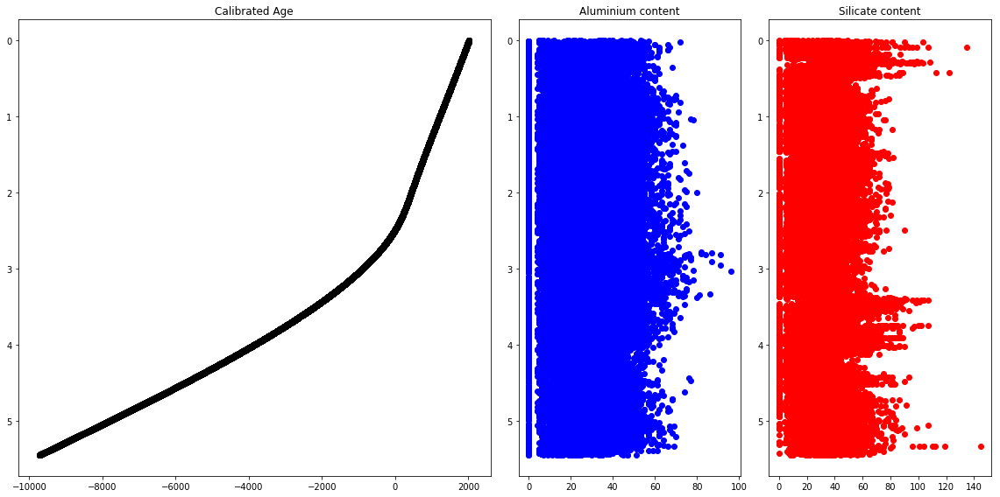
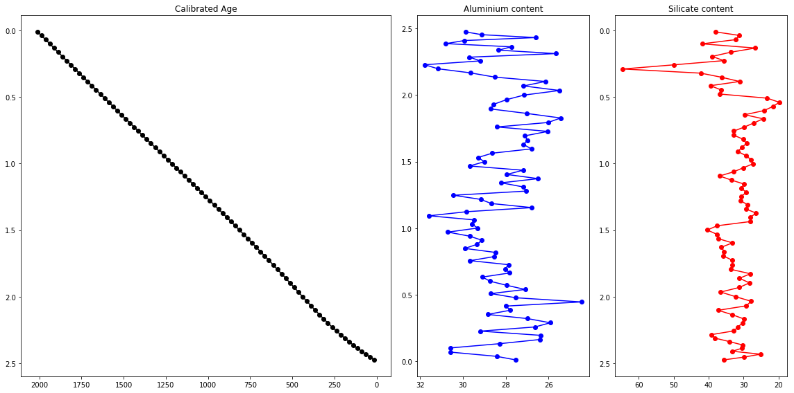

# What is Pandas? Getting started with pandas

To analyze data, we like to use two-dimensional tables – like in SQL and in Excel. Originally, Python didn’t have this feature.  But that’s why Pandas is so important! I like to say, Pandas is the “SQL of Python.”  Pandas is the library that will help us to handle two-dimensional data tables in Python. In many senses it’s really similar to SQL, though.

## Why should I use Pandas to work with data? 

Because:
- handle headings better than with Numpy 
- Pandas Series and DataFrame are also Numpy arrays
- provide some clarity in your data
- especially important if you work with time series as you can downscale and upscale your data based on the time series

# Essential functions

Top 20 most popular pandas function on GitHub (in 2016)
https://galeascience.wordpress.com/2016/08/10/top-10-pandas-numpy-and-scipy-functions-on-github/


```python
import pandas as pd
import numpy as np
```

# How can I import data with Pandas? 

- Array can be created as in Numpy (*Series*)
- Data can be imported from text files (.csv, .txt and other type of text formats) or directly from excel files (*DataFrames*)

## Series
One-dimensional array-like object (very similar to Numpy 1-D arrays). ```pd.Series``` is characterized by an index and a single column.


```python
temperature_Oslo = pd.Series([4, 6, 6, 9, 8, 7, 8]) # temperature in the middle of the day at Blindern for the next 7 days

temperature_Oslo
```


    0    4
    1    6
    2    6
    3    9
    4    8
    5    7
    6    8
    dtype: int64


By default, the index starts at 0 and stop at the last value in your ```pd.Series``` dataset


```python
temperature_Oslo.index # same as range(7) or np.arange(7)
```


    RangeIndex(start=0, stop=7, step=1)


The index can be modified by accessing the index key ```pd.Series.index```


```python
# indexes can be later modified by doing
temperature_Oslo.index = ['Monday', 'Tuesday', 'Wednesday', 'Thursday', 'Friday', 'Saturday', 'Sunday']
temperature_Oslo.index
```


    Index(['Monday', 'Tuesday', 'Wednesday', 'Thursday', 'Friday', 'Saturday',
           'Sunday'],
          dtype='object')


The easiest way to create a ```pd.Series``` is to define a dictionnary and pass it to the ```pd.Series```


```python
ndata = {'Monday' : 4 , 'Tuesday' : 6 , 'Wednesday' : 6 , 'Thursday' : 9 , 'Friday' : 8 , 'Saturday' : 7, 'Sunday' : 8}


# feed pd.Series the previously created dictionary
temperature_Oslo = pd.Series(ndata)

# print the data on the screen
temperature_Oslo
```


    Monday       4
    Tuesday      6
    Wednesday    6
    Thursday     9
    Friday       8
    Saturday     7
    Sunday       8
    dtype: int64


Values within the ```pd.Series``` can be accessed either by ```pd.Series[variable]``` or ```pd.Series.variable```


```python
# change in temperature between Monday and Tuesday
print (temperature_Oslo['Monday'] - temperature_Oslo['Tuesday'])

# similar to
print (temperature_Oslo.Monday - temperature_Oslo.Tuesday)
```

    -2
    -2


## DataFrame

DataFrame is the most popular function used in Pandas. Help to deal with large rectangular datasets. There are many ways to construct a DataFrame, and can mostly be separated in two groups:
- Manually, by specifying a dictionary containing a string (the header) and a list of numbers or strings
- Importing a text or excel file, which contains a x number of data 

## Creating a DataFrame manually

We can again make us of dictionnary variables but this time we will have a dataset with a multiple number of columns


```python
data = {'Day of the week' : ['Monday', 'Tuesday', 'Wednesday', 'Thursday', 'Friday', 'Saturday', 'Sunday'],
        'Temperature in the middle of the day' : [4, 6, 6, 9, 8, 7, 8],
        'Wind (m/s)' : [1, 6, 2, 2, 4, 3, 3],
        'Weather conditions' : ['Cloud & Sun', 'Cloud', 'Cloud', 'Cloud & Sun', 'Cloud & Sun', 'Sun', 'Cloud']}

frame = pd.DataFrame(data)

frame
```


<div>
<style scoped>
    .dataframe tbody tr th:only-of-type {
        vertical-align: middle;
    }

    .dataframe tbody tr th {
        vertical-align: top;
    }

    .dataframe thead th {
        text-align: right;
    }
</style>
<table border="1" class="dataframe">
  <thead>
    <tr style="text-align: right;">
      <th></th>
      <th>Day of the week</th>
      <th>Temperature in the middle of the day</th>
      <th>Wind (m/s)</th>
      <th>Weather conditions</th>
    </tr>
  </thead>
  <tbody>
    <tr>
      <th>0</th>
      <td>Monday</td>
      <td>4</td>
      <td>1</td>
      <td>Cloud &amp; Sun</td>
    </tr>
    <tr>
      <th>1</th>
      <td>Tuesday</td>
      <td>6</td>
      <td>6</td>
      <td>Cloud</td>
    </tr>
    <tr>
      <th>2</th>
      <td>Wednesday</td>
      <td>6</td>
      <td>2</td>
      <td>Cloud</td>
    </tr>
    <tr>
      <th>3</th>
      <td>Thursday</td>
      <td>9</td>
      <td>2</td>
      <td>Cloud &amp; Sun</td>
    </tr>
    <tr>
      <th>4</th>
      <td>Friday</td>
      <td>8</td>
      <td>4</td>
      <td>Cloud &amp; Sun</td>
    </tr>
    <tr>
      <th>5</th>
      <td>Saturday</td>
      <td>7</td>
      <td>3</td>
      <td>Sun</td>
    </tr>
    <tr>
      <th>6</th>
      <td>Sunday</td>
      <td>8</td>
      <td>3</td>
      <td>Cloud</td>
    </tr>
  </tbody>
</table>
</div>


## Interesting functionalities and how can I access specific data within my data set?


```python
frame.head() # print the first five rows
```


<div>
<style scoped>
    .dataframe tbody tr th:only-of-type {
        vertical-align: middle;
    }

    .dataframe tbody tr th {
        vertical-align: top;
    }

    .dataframe thead th {
        text-align: right;
    }
</style>
<table border="1" class="dataframe">
  <thead>
    <tr style="text-align: right;">
      <th></th>
      <th>depth (m)</th>
      <th>Age_04032019_0,1mm_0,01yr</th>
      <th>Age. Cal. CE</th>
      <th>Al</th>
      <th>Si</th>
      <th>P</th>
      <th>S</th>
      <th>Cl</th>
      <th>Ar</th>
      <th>K</th>
      <th>...</th>
      <th>Si/Ti</th>
      <th>P/Ti</th>
      <th>Fe/Mn</th>
      <th>Fe/Ti</th>
      <th>Pb/Ti</th>
      <th>S/OM</th>
      <th>S/Ti</th>
      <th>Hg/Mn</th>
      <th>Hg/Ti.1</th>
      <th>Hg/MO</th>
    </tr>
  </thead>
  <tbody>
    <tr>
      <th>0</th>
      <td>0.0000</td>
      <td>-68.00</td>
      <td>2018.00</td>
      <td>25</td>
      <td>11</td>
      <td>12</td>
      <td>82</td>
      <td>29</td>
      <td>136</td>
      <td>6</td>
      <td>...</td>
      <td>0.137500</td>
      <td>0.150000</td>
      <td>80.225806</td>
      <td>62.175000</td>
      <td>0.0</td>
      <td>11.958182</td>
      <td>1.025000</td>
      <td>0.000000</td>
      <td>0.000000</td>
      <td>0.000000</td>
    </tr>
    <tr>
      <th>1</th>
      <td>0.0002</td>
      <td>-67.97</td>
      <td>2017.97</td>
      <td>22</td>
      <td>0</td>
      <td>18</td>
      <td>76</td>
      <td>23</td>
      <td>167</td>
      <td>19</td>
      <td>...</td>
      <td>0.000000</td>
      <td>0.500000</td>
      <td>98.203704</td>
      <td>147.305556</td>
      <td>0.0</td>
      <td>10.919643</td>
      <td>2.111111</td>
      <td>3.092593</td>
      <td>4.638889</td>
      <td>23.994480</td>
    </tr>
    <tr>
      <th>2</th>
      <td>0.0004</td>
      <td>-67.81</td>
      <td>2017.81</td>
      <td>53</td>
      <td>6</td>
      <td>0</td>
      <td>37</td>
      <td>9</td>
      <td>141</td>
      <td>19</td>
      <td>...</td>
      <td>0.272727</td>
      <td>0.000000</td>
      <td>92.290323</td>
      <td>260.090909</td>
      <td>0.0</td>
      <td>5.525249</td>
      <td>1.681818</td>
      <td>0.274194</td>
      <td>0.772727</td>
      <td>2.538628</td>
    </tr>
    <tr>
      <th>3</th>
      <td>0.0006</td>
      <td>-67.65</td>
      <td>2017.65</td>
      <td>18</td>
      <td>6</td>
      <td>17</td>
      <td>64</td>
      <td>8</td>
      <td>167</td>
      <td>23</td>
      <td>...</td>
      <td>0.157895</td>
      <td>0.447368</td>
      <td>138.069767</td>
      <td>156.236842</td>
      <td>0.0</td>
      <td>9.239006</td>
      <td>1.684211</td>
      <td>0.000000</td>
      <td>0.000000</td>
      <td>0.000000</td>
    </tr>
    <tr>
      <th>4</th>
      <td>0.0008</td>
      <td>-67.57</td>
      <td>2017.57</td>
      <td>36</td>
      <td>32</td>
      <td>22</td>
      <td>74</td>
      <td>13</td>
      <td>129</td>
      <td>23</td>
      <td>...</td>
      <td>0.323232</td>
      <td>0.222222</td>
      <td>75.576471</td>
      <td>64.888889</td>
      <td>0.0</td>
      <td>10.632997</td>
      <td>0.747475</td>
      <td>1.000000</td>
      <td>0.858586</td>
      <td>12.213577</td>
    </tr>
  </tbody>
</table>
<p>5 rows × 45 columns</p>
</div>


```python
print (frame.columns) # print name of the columns
```

    Index(['Day of the week', 'Temperature in the middle of the day', 'Wind (m/s)',
           'Weather conditions'],
          dtype='object')


### Apply numpy functions to pandas arrays


```python
np.mean(frame['Temperature in the middle of the day'])
```


    6.857142857142857


### Switch columns in the DataFrame


```python
pd.DataFrame(data, columns=['Day of the week', 'Weather conditions', 'Temperature in the middle of the day', 'Wind (m/s)'])
```


<div>
<style scoped>
    .dataframe tbody tr th:only-of-type {
        vertical-align: middle;
    }

    .dataframe tbody tr th {
        vertical-align: top;
    }

    .dataframe thead th {
        text-align: right;
    }
</style>
<table border="1" class="dataframe">
  <thead>
    <tr style="text-align: right;">
      <th></th>
      <th>Day of the week</th>
      <th>Weather conditions</th>
      <th>Temperature in the middle of the day</th>
      <th>Wind (m/s)</th>
    </tr>
  </thead>
  <tbody>
    <tr>
      <th>0</th>
      <td>Monday</td>
      <td>Cloud &amp; Sun</td>
      <td>4</td>
      <td>1</td>
    </tr>
    <tr>
      <th>1</th>
      <td>Tuesday</td>
      <td>Cloud</td>
      <td>6</td>
      <td>6</td>
    </tr>
    <tr>
      <th>2</th>
      <td>Wednesday</td>
      <td>Cloud</td>
      <td>6</td>
      <td>2</td>
    </tr>
    <tr>
      <th>3</th>
      <td>Thursday</td>
      <td>Cloud &amp; Sun</td>
      <td>9</td>
      <td>2</td>
    </tr>
    <tr>
      <th>4</th>
      <td>Friday</td>
      <td>Cloud &amp; Sun</td>
      <td>8</td>
      <td>4</td>
    </tr>
    <tr>
      <th>5</th>
      <td>Saturday</td>
      <td>Sun</td>
      <td>7</td>
      <td>3</td>
    </tr>
    <tr>
      <th>6</th>
      <td>Sunday</td>
      <td>Cloud</td>
      <td>8</td>
      <td>3</td>
    </tr>
  </tbody>
</table>
</div>


### Locate row based on your index


```python
print (frame.loc[0])

print (frame.loc[6])
```

    Day of the week                              Monday
    Temperature in the middle of the day              4
    Wind (m/s)                                        1
    Weather conditions                      Cloud & Sun
    Name: 0, dtype: object
    Day of the week                         Sunday
    Temperature in the middle of the day         8
    Wind (m/s)                                   3
    Weather conditions                       Cloud
    Name: 6, dtype: object


### Assign values in the DataFrame


```python
# we create a new DataFrame with a new column
nframe = pd.DataFrame(data, columns=['Day of the week', 'Weather conditions', 'Temperature in the middle of the day', 
                                     'Wind (m/s)', 'Precipitation (mm)'])

nframe
```


<div>
<style scoped>
    .dataframe tbody tr th:only-of-type {
        vertical-align: middle;
    }

    .dataframe tbody tr th {
        vertical-align: top;
    }

    .dataframe thead th {
        text-align: right;
    }
</style>
<table border="1" class="dataframe">
  <thead>
    <tr style="text-align: right;">
      <th></th>
      <th>Day of the week</th>
      <th>Weather conditions</th>
      <th>Temperature in the middle of the day</th>
      <th>Wind (m/s)</th>
      <th>Precipitation (mm)</th>
    </tr>
  </thead>
  <tbody>
    <tr>
      <th>0</th>
      <td>Monday</td>
      <td>Cloud &amp; Sun</td>
      <td>4</td>
      <td>1</td>
      <td>NaN</td>
    </tr>
    <tr>
      <th>1</th>
      <td>Tuesday</td>
      <td>Cloud</td>
      <td>6</td>
      <td>6</td>
      <td>NaN</td>
    </tr>
    <tr>
      <th>2</th>
      <td>Wednesday</td>
      <td>Cloud</td>
      <td>6</td>
      <td>2</td>
      <td>NaN</td>
    </tr>
    <tr>
      <th>3</th>
      <td>Thursday</td>
      <td>Cloud &amp; Sun</td>
      <td>9</td>
      <td>2</td>
      <td>NaN</td>
    </tr>
    <tr>
      <th>4</th>
      <td>Friday</td>
      <td>Cloud &amp; Sun</td>
      <td>8</td>
      <td>4</td>
      <td>NaN</td>
    </tr>
    <tr>
      <th>5</th>
      <td>Saturday</td>
      <td>Sun</td>
      <td>7</td>
      <td>3</td>
      <td>NaN</td>
    </tr>
    <tr>
      <th>6</th>
      <td>Sunday</td>
      <td>Cloud</td>
      <td>8</td>
      <td>3</td>
      <td>NaN</td>
    </tr>
  </tbody>
</table>
</div>


Modify a single value


```python
nframe['Precipitation (mm)'].values[0] = 2.3

nframe
```


<div>
<style scoped>
    .dataframe tbody tr th:only-of-type {
        vertical-align: middle;
    }

    .dataframe tbody tr th {
        vertical-align: top;
    }

    .dataframe thead th {
        text-align: right;
    }
</style>
<table border="1" class="dataframe">
  <thead>
    <tr style="text-align: right;">
      <th></th>
      <th>Day of the week</th>
      <th>Weather conditions</th>
      <th>Temperature in the middle of the day</th>
      <th>Wind (m/s)</th>
      <th>Precipitation (mm)</th>
    </tr>
  </thead>
  <tbody>
    <tr>
      <th>0</th>
      <td>Monday</td>
      <td>Cloud &amp; Sun</td>
      <td>4</td>
      <td>1</td>
      <td>2.3</td>
    </tr>
    <tr>
      <th>1</th>
      <td>Tuesday</td>
      <td>Cloud</td>
      <td>6</td>
      <td>6</td>
      <td>NaN</td>
    </tr>
    <tr>
      <th>2</th>
      <td>Wednesday</td>
      <td>Cloud</td>
      <td>6</td>
      <td>2</td>
      <td>NaN</td>
    </tr>
    <tr>
      <th>3</th>
      <td>Thursday</td>
      <td>Cloud &amp; Sun</td>
      <td>9</td>
      <td>2</td>
      <td>NaN</td>
    </tr>
    <tr>
      <th>4</th>
      <td>Friday</td>
      <td>Cloud &amp; Sun</td>
      <td>8</td>
      <td>4</td>
      <td>NaN</td>
    </tr>
    <tr>
      <th>5</th>
      <td>Saturday</td>
      <td>Sun</td>
      <td>7</td>
      <td>3</td>
      <td>NaN</td>
    </tr>
    <tr>
      <th>6</th>
      <td>Sunday</td>
      <td>Cloud</td>
      <td>8</td>
      <td>3</td>
      <td>NaN</td>
    </tr>
  </tbody>
</table>
</div>


Modify a slice of values


```python
nframe['Precipitation (mm)'].values[1:4] = 1.0

nframe
```


<div>
<style scoped>
    .dataframe tbody tr th:only-of-type {
        vertical-align: middle;
    }

    .dataframe tbody tr th {
        vertical-align: top;
    }

    .dataframe thead th {
        text-align: right;
    }
</style>
<table border="1" class="dataframe">
  <thead>
    <tr style="text-align: right;">
      <th></th>
      <th>Day of the week</th>
      <th>Weather conditions</th>
      <th>Temperature in the middle of the day</th>
      <th>Wind (m/s)</th>
      <th>Precipitation (mm)</th>
    </tr>
  </thead>
  <tbody>
    <tr>
      <th>0</th>
      <td>Monday</td>
      <td>Cloud &amp; Sun</td>
      <td>4</td>
      <td>1</td>
      <td>2.3</td>
    </tr>
    <tr>
      <th>1</th>
      <td>Tuesday</td>
      <td>Cloud</td>
      <td>6</td>
      <td>6</td>
      <td>1</td>
    </tr>
    <tr>
      <th>2</th>
      <td>Wednesday</td>
      <td>Cloud</td>
      <td>6</td>
      <td>2</td>
      <td>1</td>
    </tr>
    <tr>
      <th>3</th>
      <td>Thursday</td>
      <td>Cloud &amp; Sun</td>
      <td>9</td>
      <td>2</td>
      <td>1</td>
    </tr>
    <tr>
      <th>4</th>
      <td>Friday</td>
      <td>Cloud &amp; Sun</td>
      <td>8</td>
      <td>4</td>
      <td>NaN</td>
    </tr>
    <tr>
      <th>5</th>
      <td>Saturday</td>
      <td>Sun</td>
      <td>7</td>
      <td>3</td>
      <td>NaN</td>
    </tr>
    <tr>
      <th>6</th>
      <td>Sunday</td>
      <td>Cloud</td>
      <td>8</td>
      <td>3</td>
      <td>NaN</td>
    </tr>
  </tbody>
</table>
</div>


Change all values


```python
nframe['Precipitation (mm)'] = 0.0 #equivalent to nframe['Precipitation (mm)'].values[:] = 0.0

nframe
```


<div>
<style scoped>
    .dataframe tbody tr th:only-of-type {
        vertical-align: middle;
    }

    .dataframe tbody tr th {
        vertical-align: top;
    }

    .dataframe thead th {
        text-align: right;
    }
</style>
<table border="1" class="dataframe">
  <thead>
    <tr style="text-align: right;">
      <th></th>
      <th>Day of the week</th>
      <th>Weather conditions</th>
      <th>Temperature in the middle of the day</th>
      <th>Wind (m/s)</th>
      <th>Precipitation (mm)</th>
    </tr>
  </thead>
  <tbody>
    <tr>
      <th>0</th>
      <td>Monday</td>
      <td>Cloud &amp; Sun</td>
      <td>4</td>
      <td>1</td>
      <td>0.0</td>
    </tr>
    <tr>
      <th>1</th>
      <td>Tuesday</td>
      <td>Cloud</td>
      <td>6</td>
      <td>6</td>
      <td>0.0</td>
    </tr>
    <tr>
      <th>2</th>
      <td>Wednesday</td>
      <td>Cloud</td>
      <td>6</td>
      <td>2</td>
      <td>0.0</td>
    </tr>
    <tr>
      <th>3</th>
      <td>Thursday</td>
      <td>Cloud &amp; Sun</td>
      <td>9</td>
      <td>2</td>
      <td>0.0</td>
    </tr>
    <tr>
      <th>4</th>
      <td>Friday</td>
      <td>Cloud &amp; Sun</td>
      <td>8</td>
      <td>4</td>
      <td>0.0</td>
    </tr>
    <tr>
      <th>5</th>
      <td>Saturday</td>
      <td>Sun</td>
      <td>7</td>
      <td>3</td>
      <td>0.0</td>
    </tr>
    <tr>
      <th>6</th>
      <td>Sunday</td>
      <td>Cloud</td>
      <td>8</td>
      <td>3</td>
      <td>0.0</td>
    </tr>
  </tbody>
</table>
</div>


### Indexing, reindexing, selection with loc and iloc


```python
nframe = nframe.set_index('Day of the week')

nframe
```


<div>
<style scoped>
    .dataframe tbody tr th:only-of-type {
        vertical-align: middle;
    }

    .dataframe tbody tr th {
        vertical-align: top;
    }

    .dataframe thead th {
        text-align: right;
    }
</style>
<table border="1" class="dataframe">
  <thead>
    <tr style="text-align: right;">
      <th></th>
      <th>Weather conditions</th>
      <th>Temperature in the middle of the day</th>
      <th>Wind (m/s)</th>
      <th>Precipitation (mm)</th>
    </tr>
    <tr>
      <th>Day of the week</th>
      <th></th>
      <th></th>
      <th></th>
      <th></th>
    </tr>
  </thead>
  <tbody>
    <tr>
      <th>Monday</th>
      <td>Cloud &amp; Sun</td>
      <td>4</td>
      <td>1</td>
      <td>NaN</td>
    </tr>
    <tr>
      <th>Tuesday</th>
      <td>Cloud</td>
      <td>6</td>
      <td>6</td>
      <td>NaN</td>
    </tr>
    <tr>
      <th>Wednesday</th>
      <td>Cloud</td>
      <td>6</td>
      <td>2</td>
      <td>NaN</td>
    </tr>
    <tr>
      <th>Thursday</th>
      <td>Cloud &amp; Sun</td>
      <td>9</td>
      <td>2</td>
      <td>NaN</td>
    </tr>
    <tr>
      <th>Friday</th>
      <td>Cloud &amp; Sun</td>
      <td>8</td>
      <td>4</td>
      <td>NaN</td>
    </tr>
    <tr>
      <th>Saturday</th>
      <td>Sun</td>
      <td>7</td>
      <td>3</td>
      <td>NaN</td>
    </tr>
    <tr>
      <th>Sunday</th>
      <td>Cloud</td>
      <td>8</td>
      <td>3</td>
      <td>NaN</td>
    </tr>
  </tbody>
</table>
</div>


```python
nframe.loc['Monday']
```


    Weather conditions                      Cloud & Sun
    Temperature in the middle of the day              4
    Wind (m/s)                                        1
    Precipitation (mm)                              NaN
    Name: Monday, dtype: object


```python
nframe.iloc[0]
```


    Weather conditions                      Cloud & Sun
    Temperature in the middle of the day              4
    Wind (m/s)                                        1
    Precipitation (mm)                              NaN
    Name: Monday, dtype: object


```python
# re-indexing
nframe2 = nframe.reindex(['Wednesday', 'Thursday', 'Friday', 'Saturday', 'Sunday','Monday', 'Tuesday'])

nframe2
```


<div>
<style scoped>
    .dataframe tbody tr th:only-of-type {
        vertical-align: middle;
    }

    .dataframe tbody tr th {
        vertical-align: top;
    }

    .dataframe thead th {
        text-align: right;
    }
</style>
<table border="1" class="dataframe">
  <thead>
    <tr style="text-align: right;">
      <th></th>
      <th>Weather conditions</th>
      <th>Temperature in the middle of the day</th>
      <th>Wind (m/s)</th>
      <th>Precipitation (mm)</th>
    </tr>
    <tr>
      <th>Day of the week</th>
      <th></th>
      <th></th>
      <th></th>
      <th></th>
    </tr>
  </thead>
  <tbody>
    <tr>
      <th>Wednesday</th>
      <td>Cloud</td>
      <td>6</td>
      <td>2</td>
      <td>NaN</td>
    </tr>
    <tr>
      <th>Thursday</th>
      <td>Cloud &amp; Sun</td>
      <td>9</td>
      <td>2</td>
      <td>NaN</td>
    </tr>
    <tr>
      <th>Friday</th>
      <td>Cloud &amp; Sun</td>
      <td>8</td>
      <td>4</td>
      <td>NaN</td>
    </tr>
    <tr>
      <th>Saturday</th>
      <td>Sun</td>
      <td>7</td>
      <td>3</td>
      <td>NaN</td>
    </tr>
    <tr>
      <th>Sunday</th>
      <td>Cloud</td>
      <td>8</td>
      <td>3</td>
      <td>NaN</td>
    </tr>
    <tr>
      <th>Monday</th>
      <td>Cloud &amp; Sun</td>
      <td>4</td>
      <td>1</td>
      <td>NaN</td>
    </tr>
    <tr>
      <th>Tuesday</th>
      <td>Cloud</td>
      <td>6</td>
      <td>6</td>
      <td>NaN</td>
    </tr>
  </tbody>
</table>
</div>


### Sorting of columns

Sort by a column


```python
nframe2.sort_values(by='Temperature in the middle of the day') #default ascending
```


<div>
<style scoped>
    .dataframe tbody tr th:only-of-type {
        vertical-align: middle;
    }

    .dataframe tbody tr th {
        vertical-align: top;
    }

    .dataframe thead th {
        text-align: right;
    }
</style>
<table border="1" class="dataframe">
  <thead>
    <tr style="text-align: right;">
      <th></th>
      <th>Weather conditions</th>
      <th>Temperature in the middle of the day</th>
      <th>Wind (m/s)</th>
      <th>Precipitation (mm)</th>
    </tr>
    <tr>
      <th>Day of the week</th>
      <th></th>
      <th></th>
      <th></th>
      <th></th>
    </tr>
  </thead>
  <tbody>
    <tr>
      <th>Monday</th>
      <td>Cloud &amp; Sun</td>
      <td>4</td>
      <td>1</td>
      <td>NaN</td>
    </tr>
    <tr>
      <th>Wednesday</th>
      <td>Cloud</td>
      <td>6</td>
      <td>2</td>
      <td>NaN</td>
    </tr>
    <tr>
      <th>Tuesday</th>
      <td>Cloud</td>
      <td>6</td>
      <td>6</td>
      <td>NaN</td>
    </tr>
    <tr>
      <th>Saturday</th>
      <td>Sun</td>
      <td>7</td>
      <td>3</td>
      <td>NaN</td>
    </tr>
    <tr>
      <th>Friday</th>
      <td>Cloud &amp; Sun</td>
      <td>8</td>
      <td>4</td>
      <td>NaN</td>
    </tr>
    <tr>
      <th>Sunday</th>
      <td>Cloud</td>
      <td>8</td>
      <td>3</td>
      <td>NaN</td>
    </tr>
    <tr>
      <th>Thursday</th>
      <td>Cloud &amp; Sun</td>
      <td>9</td>
      <td>2</td>
      <td>NaN</td>
    </tr>
  </tbody>
</table>
</div>


```python
nframe2.sort_values(by='Temperature in the middle of the day', ascending=False) #descending
```


<div>
<style scoped>
    .dataframe tbody tr th:only-of-type {
        vertical-align: middle;
    }

    .dataframe tbody tr th {
        vertical-align: top;
    }

    .dataframe thead th {
        text-align: right;
    }
</style>
<table border="1" class="dataframe">
  <thead>
    <tr style="text-align: right;">
      <th></th>
      <th>Weather conditions</th>
      <th>Temperature in the middle of the day</th>
      <th>Wind (m/s)</th>
      <th>Precipitation (mm)</th>
    </tr>
    <tr>
      <th>Day of the week</th>
      <th></th>
      <th></th>
      <th></th>
      <th></th>
    </tr>
  </thead>
  <tbody>
    <tr>
      <th>Thursday</th>
      <td>Cloud &amp; Sun</td>
      <td>9</td>
      <td>2</td>
      <td>NaN</td>
    </tr>
    <tr>
      <th>Friday</th>
      <td>Cloud &amp; Sun</td>
      <td>8</td>
      <td>4</td>
      <td>NaN</td>
    </tr>
    <tr>
      <th>Sunday</th>
      <td>Cloud</td>
      <td>8</td>
      <td>3</td>
      <td>NaN</td>
    </tr>
    <tr>
      <th>Saturday</th>
      <td>Sun</td>
      <td>7</td>
      <td>3</td>
      <td>NaN</td>
    </tr>
    <tr>
      <th>Wednesday</th>
      <td>Cloud</td>
      <td>6</td>
      <td>2</td>
      <td>NaN</td>
    </tr>
    <tr>
      <th>Tuesday</th>
      <td>Cloud</td>
      <td>6</td>
      <td>6</td>
      <td>NaN</td>
    </tr>
    <tr>
      <th>Monday</th>
      <td>Cloud &amp; Sun</td>
      <td>4</td>
      <td>1</td>
      <td>NaN</td>
    </tr>
  </tbody>
</table>
</div>


Sorting by multiple columns


```python
nframe2.sort_values(by=['Temperature in the middle of the day', 'Wind (m/s)'], ascending=False) #descending
```


<div>
<style scoped>
    .dataframe tbody tr th:only-of-type {
        vertical-align: middle;
    }

    .dataframe tbody tr th {
        vertical-align: top;
    }

    .dataframe thead th {
        text-align: right;
    }
</style>
<table border="1" class="dataframe">
  <thead>
    <tr style="text-align: right;">
      <th></th>
      <th>Weather conditions</th>
      <th>Temperature in the middle of the day</th>
      <th>Wind (m/s)</th>
      <th>Precipitation (mm)</th>
    </tr>
    <tr>
      <th>Day of the week</th>
      <th></th>
      <th></th>
      <th></th>
      <th></th>
    </tr>
  </thead>
  <tbody>
    <tr>
      <th>Thursday</th>
      <td>Cloud &amp; Sun</td>
      <td>9</td>
      <td>2</td>
      <td>NaN</td>
    </tr>
    <tr>
      <th>Friday</th>
      <td>Cloud &amp; Sun</td>
      <td>8</td>
      <td>4</td>
      <td>NaN</td>
    </tr>
    <tr>
      <th>Sunday</th>
      <td>Cloud</td>
      <td>8</td>
      <td>3</td>
      <td>NaN</td>
    </tr>
    <tr>
      <th>Saturday</th>
      <td>Sun</td>
      <td>7</td>
      <td>3</td>
      <td>NaN</td>
    </tr>
    <tr>
      <th>Tuesday</th>
      <td>Cloud</td>
      <td>6</td>
      <td>6</td>
      <td>NaN</td>
    </tr>
    <tr>
      <th>Wednesday</th>
      <td>Cloud</td>
      <td>6</td>
      <td>2</td>
      <td>NaN</td>
    </tr>
    <tr>
      <th>Monday</th>
      <td>Cloud &amp; Sun</td>
      <td>4</td>
      <td>1</td>
      <td>NaN</td>
    </tr>
  </tbody>
</table>
</div>


## Importing a DataFrame
Data is provided by Manon


```python
path = '../data/Manon/' #directory to the file we would like to import
filename = 'data_manon_python.xlsx'  # filename

frame = pd.read_excel(path + filename)

frame.head()
```


<div>
<style scoped>
    .dataframe tbody tr th:only-of-type {
        vertical-align: middle;
    }

    .dataframe tbody tr th {
        vertical-align: top;
    }

    .dataframe thead th {
        text-align: right;
    }
</style>
<table border="1" class="dataframe">
  <thead>
    <tr style="text-align: right;">
      <th></th>
      <th>depth (m)</th>
      <th>Age_04032019_0,1mm_0,01yr</th>
      <th>Age. Cal. CE</th>
      <th>Al</th>
      <th>Si</th>
      <th>P</th>
      <th>S</th>
      <th>Cl</th>
      <th>Ar</th>
      <th>K</th>
      <th>...</th>
      <th>Si/Ti</th>
      <th>P/Ti</th>
      <th>Fe/Mn</th>
      <th>Fe/Ti</th>
      <th>Pb/Ti</th>
      <th>S/OM</th>
      <th>S/Ti</th>
      <th>Hg/Mn</th>
      <th>Hg/Ti.1</th>
      <th>Hg/MO</th>
    </tr>
  </thead>
  <tbody>
    <tr>
      <th>0</th>
      <td>0.0000</td>
      <td>-68.00</td>
      <td>2018.00</td>
      <td>25</td>
      <td>11</td>
      <td>12</td>
      <td>82</td>
      <td>29</td>
      <td>136</td>
      <td>6</td>
      <td>...</td>
      <td>0.137500</td>
      <td>0.150000</td>
      <td>80.225806</td>
      <td>62.175000</td>
      <td>0.0</td>
      <td>11.958182</td>
      <td>1.025000</td>
      <td>0.000000</td>
      <td>0.000000</td>
      <td>0.000000</td>
    </tr>
    <tr>
      <th>1</th>
      <td>0.0002</td>
      <td>-67.97</td>
      <td>2017.97</td>
      <td>22</td>
      <td>0</td>
      <td>18</td>
      <td>76</td>
      <td>23</td>
      <td>167</td>
      <td>19</td>
      <td>...</td>
      <td>0.000000</td>
      <td>0.500000</td>
      <td>98.203704</td>
      <td>147.305556</td>
      <td>0.0</td>
      <td>10.919643</td>
      <td>2.111111</td>
      <td>3.092593</td>
      <td>4.638889</td>
      <td>23.994480</td>
    </tr>
    <tr>
      <th>2</th>
      <td>0.0004</td>
      <td>-67.81</td>
      <td>2017.81</td>
      <td>53</td>
      <td>6</td>
      <td>0</td>
      <td>37</td>
      <td>9</td>
      <td>141</td>
      <td>19</td>
      <td>...</td>
      <td>0.272727</td>
      <td>0.000000</td>
      <td>92.290323</td>
      <td>260.090909</td>
      <td>0.0</td>
      <td>5.525249</td>
      <td>1.681818</td>
      <td>0.274194</td>
      <td>0.772727</td>
      <td>2.538628</td>
    </tr>
    <tr>
      <th>3</th>
      <td>0.0006</td>
      <td>-67.65</td>
      <td>2017.65</td>
      <td>18</td>
      <td>6</td>
      <td>17</td>
      <td>64</td>
      <td>8</td>
      <td>167</td>
      <td>23</td>
      <td>...</td>
      <td>0.157895</td>
      <td>0.447368</td>
      <td>138.069767</td>
      <td>156.236842</td>
      <td>0.0</td>
      <td>9.239006</td>
      <td>1.684211</td>
      <td>0.000000</td>
      <td>0.000000</td>
      <td>0.000000</td>
    </tr>
    <tr>
      <th>4</th>
      <td>0.0008</td>
      <td>-67.57</td>
      <td>2017.57</td>
      <td>36</td>
      <td>32</td>
      <td>22</td>
      <td>74</td>
      <td>13</td>
      <td>129</td>
      <td>23</td>
      <td>...</td>
      <td>0.323232</td>
      <td>0.222222</td>
      <td>75.576471</td>
      <td>64.888889</td>
      <td>0.0</td>
      <td>10.632997</td>
      <td>0.747475</td>
      <td>1.000000</td>
      <td>0.858586</td>
      <td>12.213577</td>
    </tr>
  </tbody>
</table>
<p>5 rows × 45 columns</p>
</div>


```python
import matplotlib.pyplot as plt
from matplotlib.gridspec import GridSpec

%matplotlib inline

fig = plt.figure(figsize=(16,8))


gs=GridSpec(2,4) # 2 rows, 4 columns

ax1=fig.add_subplot(gs[:,:2]) # Span all rows, firs two columns
ax2=fig.add_subplot(gs[:,2]) # Span all rows, third column
ax3=fig.add_subplot(gs[:,3]) # Span all rows, fourth column

ax1.set_title('Calibrated Age')
ax2.set_title('Aluminium content')
ax3.set_title('Silicate content')

ax1.plot(frame['Age. Cal. CE'],frame['depth (m)'],"ko")
ax1.set_ylim(ax1.get_ylim()[::-1]) 

ax2.plot(frame['Al'],frame['depth (m)'],"bo")
ax2.set_ylim(ax2.get_ylim()[::-1]) 

ax3.plot(frame['Si'],frame['depth (m)'],"ro")
ax3.set_ylim(ax3.get_ylim()[::-1]) 

fig.tight_layout()
```





# Time series
For some of you, most of your data are time series. Time series can be differentiated in two main groups:
- Fixed periods, such as a dataset where you will have data once a day (daily)
- Intervals of time, i.e, discontinuous periods, indicated by a start and end time

**we will here see how you can work with timeseries in Pandas**


## Most important is to have a date format that will be recognized by Python!

## Date format


```python
from datetime import datetime

now = datetime.now()

now
```


    datetime.datetime(2019, 3, 31, 12, 37, 38, 694910)


```python
now.year, now.month, now.day
```


    (2019, 3, 31)


## Convertion between String and Datetime

More information about the different datetime format can be found here: http://strftime.org/

Most commonly used functions are within the ```datetime``` and ```dateutil``` modules

### Date to string format


```python
timestamp = datetime(2019, 1, 1) # date format

str(timestamp) # string format
```


    '2019-01-01 00:00:00'


```python
timestamp.strftime('%Y-%m-%d') # string format
```


    '2019-01-01'


### String to date format


```python
timestamp_str = '2019/04/01'

datetime.strptime(timestamp_str, '%Y/%m/%d')
```


    datetime.datetime(2019, 4, 1, 0, 0)


```parse``` is also a handy function to convert string to date format

Here are few examples:


```python
from dateutil.parser import parse

parse('2019/04/01')
```


    datetime.datetime(2019, 4, 1, 0, 0)


```python
parse('01/04/2019', dayfirst=True) # day in front
```


    datetime.datetime(2019, 4, 1, 0, 0)


In most cases we will work with intervals of date (either continuous or discontinuous).

The easiest case is for **continuous measurements** as the integrated function ```pd.date_range``` can be used


```python
pd.date_range?
```


```python
dates_2019 = pd.date_range(start='2019/01/01', end='2019/04/01') # default is daily data

dates_2019
```


    DatetimeIndex(['2019-01-01', '2019-01-02', '2019-01-03', '2019-01-04',
                   '2019-01-05', '2019-01-06', '2019-01-07', '2019-01-08',
                   '2019-01-09', '2019-01-10', '2019-01-11', '2019-01-12',
                   '2019-01-13', '2019-01-14', '2019-01-15', '2019-01-16',
                   '2019-01-17', '2019-01-18', '2019-01-19', '2019-01-20',
                   '2019-01-21', '2019-01-22', '2019-01-23', '2019-01-24',
                   '2019-01-25', '2019-01-26', '2019-01-27', '2019-01-28',
                   '2019-01-29', '2019-01-30', '2019-01-31', '2019-02-01',
                   '2019-02-02', '2019-02-03', '2019-02-04', '2019-02-05',
                   '2019-02-06', '2019-02-07', '2019-02-08', '2019-02-09',
                   '2019-02-10', '2019-02-11', '2019-02-12', '2019-02-13',
                   '2019-02-14', '2019-02-15', '2019-02-16', '2019-02-17',
                   '2019-02-18', '2019-02-19', '2019-02-20', '2019-02-21',
                   '2019-02-22', '2019-02-23', '2019-02-24', '2019-02-25',
                   '2019-02-26', '2019-02-27', '2019-02-28', '2019-03-01',
                   '2019-03-02', '2019-03-03', '2019-03-04', '2019-03-05',
                   '2019-03-06', '2019-03-07', '2019-03-08', '2019-03-09',
                   '2019-03-10', '2019-03-11', '2019-03-12', '2019-03-13',
                   '2019-03-14', '2019-03-15', '2019-03-16', '2019-03-17',
                   '2019-03-18', '2019-03-19', '2019-03-20', '2019-03-21',
                   '2019-03-22', '2019-03-23', '2019-03-24', '2019-03-25',
                   '2019-03-26', '2019-03-27', '2019-03-28', '2019-03-29',
                   '2019-03-30', '2019-03-31', '2019-04-01'],
                  dtype='datetime64[ns]', freq='D')


For **discontinuous measurements**, you have to build your own list of dates either:
- manually
- or by importing your datasets with specific timestamps


```python
list_of_dates = ['01/01/2019', '19/01/2019', '25/02/2019', '07/03/2019', '01/04/2019'] # day-first european style


converted_list_of_dates = [parse(x, dayfirst=True) for x in list_of_dates]

converted_list_of_dates
```


    [datetime.datetime(2019, 1, 1, 0, 0),
     datetime.datetime(2019, 1, 19, 0, 0),
     datetime.datetime(2019, 2, 25, 0, 0),
     datetime.datetime(2019, 3, 7, 0, 0),
     datetime.datetime(2019, 4, 1, 0, 0)]


Let's work with the data Manon provided where a calibrated age ```frame['Age. Cal. CE']``` is available


```python
frame['Age. Cal. CE'].head() #print the first 5 values
```


    0    2018.00
    1    2017.97
    2    2017.81
    3    2017.65
    4    2017.57
    Name: Age. Cal. CE, dtype: float64


We need to transform this column into a date format pandas will familiar with 

There are several ways of doing that! 

**Extracting the year**


```python
years = np.floor(frame['Age. Cal. CE'].values)

years
```


    array([ 2018.,  2017.,  2017., ..., -9718., -9719., -9720.])


```python
years = years.astype('int')

years_str = years.astype('str')

years_str
```


    array(['2018', '2017', '2017', ..., '-9718', '-9719', '-9720'],
          dtype='<U11')


**Extracting the month and the day**


```python
months_and_days = frame['Age. Cal. CE'].values - years

months_and_days
```


    array([0.  , 0.97, 0.81, ..., 0.62, 0.76, 0.91])


```python
months_and_days2 = np.round(months_and_days * 365.25)
months_and_days3 = months_and_days2.astype('int') # integer
months_and_days3
```


    array([  0, 354, 296, ..., 226, 278, 332])


```python
# set 0 equal to 1 (avoid problem with day of the year = 0)
months_and_days3[months_and_days3 < 1] = 1 

months_and_days3
```


    array([  1, 354, 296, ..., 226, 278, 332])


```python
months_and_days_str = months_and_days3.astype('str')
months_and_days_str
```


    array(['1', '354', '296', ..., '226', '278', '332'], dtype='<U11')


```python
tmp_date = years_str[0].zfill(4) + "/" + months_and_days_str[0].zfill(3) #zfill write 331 as 0331

tmp_date
```


    '2018/001'


```python
datetime_viking = [] # create an empty list

# need to loop through the numpy array
for ix, dates_i in np.ndenumerate(months_and_days_str): #loop through strings
    
    # we save only the dates before Jesus
    if years[ix] > 0: #datetime does not support negative years or BC dates, need to work with Julian date format?
        tmp_date = years_str[ix].zfill(4) + "/" + months_and_days_str[ix].zfill(3)
        
        # save to originally empty list
        datetime_viking.append(datetime.strptime(tmp_date, '%Y/%j'))
        
datetime_viking[:5] # print first five dates
```


    [datetime.datetime(2018, 1, 1, 0, 0),
     datetime.datetime(2017, 12, 20, 0, 0),
     datetime.datetime(2017, 10, 23, 0, 0),
     datetime.datetime(2017, 8, 25, 0, 0),
     datetime.datetime(2017, 7, 27, 0, 0)]


```python
# need to convert to pandas datetime (datetime_viking is a list while we need to work with pandas or numpy array)

# empty panda series
date_pandas = pd.Series([])

#need to use period if we want to work with period younger than 1677

for ix, datev in enumerate(datetime_viking):
    
    date_tmp = pd.Period(year= datetime_viking[ix].year, month =datetime_viking[ix].month, day = datetime_viking[ix].day, freq='D')  
    #print (date_tmp)
    date_pandas = date_pandas.append(pd.Series([date_tmp]))
    
date_pandas.head()
```


    0    2018-01-01
    0    2017-12-20
    0    2017-10-23
    0    2017-08-25
    0    2017-07-27
    dtype: period[D]


```python
# we need to create a new data frame containing only data before JC
frame_shortened = frame.iloc[0:len(datetime_viking)]

# and we set the dates as index
frame_shortened.index = date_pandas

# let's have a look at the dataframe
frame_shortened.head()
```


<div>
<style scoped>
    .dataframe tbody tr th:only-of-type {
        vertical-align: middle;
    }

    .dataframe tbody tr th {
        vertical-align: top;
    }

    .dataframe thead th {
        text-align: right;
    }
</style>
<table border="1" class="dataframe">
  <thead>
    <tr style="text-align: right;">
      <th></th>
      <th>depth (m)</th>
      <th>Age_04032019_0,1mm_0,01yr</th>
      <th>Age. Cal. CE</th>
      <th>Al</th>
      <th>Si</th>
      <th>P</th>
      <th>S</th>
      <th>Cl</th>
      <th>Ar</th>
      <th>K</th>
      <th>...</th>
      <th>Si/Ti</th>
      <th>P/Ti</th>
      <th>Fe/Mn</th>
      <th>Fe/Ti</th>
      <th>Pb/Ti</th>
      <th>S/OM</th>
      <th>S/Ti</th>
      <th>Hg/Mn</th>
      <th>Hg/Ti.1</th>
      <th>Hg/MO</th>
    </tr>
  </thead>
  <tbody>
    <tr>
      <th>2018-01-01</th>
      <td>0.0000</td>
      <td>-68.00</td>
      <td>2018.00</td>
      <td>25</td>
      <td>11</td>
      <td>12</td>
      <td>82</td>
      <td>29</td>
      <td>136</td>
      <td>6</td>
      <td>...</td>
      <td>0.137500</td>
      <td>0.150000</td>
      <td>80.225806</td>
      <td>62.175000</td>
      <td>0.0</td>
      <td>11.958182</td>
      <td>1.025000</td>
      <td>0.000000</td>
      <td>0.000000</td>
      <td>0.000000</td>
    </tr>
    <tr>
      <th>2017-12-20</th>
      <td>0.0002</td>
      <td>-67.97</td>
      <td>2017.97</td>
      <td>22</td>
      <td>0</td>
      <td>18</td>
      <td>76</td>
      <td>23</td>
      <td>167</td>
      <td>19</td>
      <td>...</td>
      <td>0.000000</td>
      <td>0.500000</td>
      <td>98.203704</td>
      <td>147.305556</td>
      <td>0.0</td>
      <td>10.919643</td>
      <td>2.111111</td>
      <td>3.092593</td>
      <td>4.638889</td>
      <td>23.994480</td>
    </tr>
    <tr>
      <th>2017-10-23</th>
      <td>0.0004</td>
      <td>-67.81</td>
      <td>2017.81</td>
      <td>53</td>
      <td>6</td>
      <td>0</td>
      <td>37</td>
      <td>9</td>
      <td>141</td>
      <td>19</td>
      <td>...</td>
      <td>0.272727</td>
      <td>0.000000</td>
      <td>92.290323</td>
      <td>260.090909</td>
      <td>0.0</td>
      <td>5.525249</td>
      <td>1.681818</td>
      <td>0.274194</td>
      <td>0.772727</td>
      <td>2.538628</td>
    </tr>
    <tr>
      <th>2017-08-25</th>
      <td>0.0006</td>
      <td>-67.65</td>
      <td>2017.65</td>
      <td>18</td>
      <td>6</td>
      <td>17</td>
      <td>64</td>
      <td>8</td>
      <td>167</td>
      <td>23</td>
      <td>...</td>
      <td>0.157895</td>
      <td>0.447368</td>
      <td>138.069767</td>
      <td>156.236842</td>
      <td>0.0</td>
      <td>9.239006</td>
      <td>1.684211</td>
      <td>0.000000</td>
      <td>0.000000</td>
      <td>0.000000</td>
    </tr>
    <tr>
      <th>2017-07-27</th>
      <td>0.0008</td>
      <td>-67.57</td>
      <td>2017.57</td>
      <td>36</td>
      <td>32</td>
      <td>22</td>
      <td>74</td>
      <td>13</td>
      <td>129</td>
      <td>23</td>
      <td>...</td>
      <td>0.323232</td>
      <td>0.222222</td>
      <td>75.576471</td>
      <td>64.888889</td>
      <td>0.0</td>
      <td>10.632997</td>
      <td>0.747475</td>
      <td>1.000000</td>
      <td>0.858586</td>
      <td>12.213577</td>
    </tr>
  </tbody>
</table>
<p>5 rows × 45 columns</p>
</div>


## Resampling and Frequency Conversion

Let's say we would like to downsample for every year.


```python
nframe_resampled = frame_shortened.resample('25Y').mean() # seems that it's indexing from year 0000 and to our time now
nframe_resampled.head()
#every 10 years
#frame_shortened.resample('10Y').mean().head()

# you can also sum the values
#frame_shortened.resample('Y').sum().head()
#frame_shortened.resample('Y', closed='right').sum().head()
```


<div>
<style scoped>
    .dataframe tbody tr th:only-of-type {
        vertical-align: middle;
    }

    .dataframe tbody tr th {
        vertical-align: top;
    }

    .dataframe thead th {
        text-align: right;
    }
</style>
<table border="1" class="dataframe">
  <thead>
    <tr style="text-align: right;">
      <th></th>
      <th>depth (m)</th>
      <th>Age_04032019_0,1mm_0,01yr</th>
      <th>Age. Cal. CE</th>
      <th>Al</th>
      <th>Si</th>
      <th>P</th>
      <th>S</th>
      <th>Cl</th>
      <th>Ar</th>
      <th>K</th>
      <th>...</th>
      <th>Si/Ti</th>
      <th>P/Ti</th>
      <th>Fe/Mn</th>
      <th>Fe/Ti</th>
      <th>Pb/Ti</th>
      <th>S/OM</th>
      <th>S/Ti</th>
      <th>Hg/Mn</th>
      <th>Hg/Ti.1</th>
      <th>Hg/MO</th>
    </tr>
  </thead>
  <tbody>
    <tr>
      <th>0001</th>
      <td>2.4745</td>
      <td>1936.472647</td>
      <td>13.527353</td>
      <td>29.872549</td>
      <td>35.637255</td>
      <td>25.529412</td>
      <td>38.784314</td>
      <td>11.509804</td>
      <td>86.343137</td>
      <td>25.294118</td>
      <td>...</td>
      <td>0.979590</td>
      <td>0.795697</td>
      <td>131.434015</td>
      <td>1134.813577</td>
      <td>4.476796</td>
      <td>6.954856</td>
      <td>1.150850</td>
      <td>0.232581</td>
      <td>1.461225</td>
      <td>9.769755</td>
    </tr>
    <tr>
      <th>0026</th>
      <td>2.4536</td>
      <td>1911.445607</td>
      <td>38.554393</td>
      <td>29.121495</td>
      <td>29.831776</td>
      <td>23.420561</td>
      <td>40.149533</td>
      <td>9.485981</td>
      <td>85.831776</td>
      <td>22.364486</td>
      <td>...</td>
      <td>1.008435</td>
      <td>0.809064</td>
      <td>129.686522</td>
      <td>1026.843370</td>
      <td>4.456455</td>
      <td>7.024561</td>
      <td>1.338224</td>
      <td>0.202993</td>
      <td>1.404651</td>
      <td>7.962508</td>
    </tr>
    <tr>
      <th>0051</th>
      <td>2.4319</td>
      <td>1886.336636</td>
      <td>63.663364</td>
      <td>26.600000</td>
      <td>25.218182</td>
      <td>22.481818</td>
      <td>46.072727</td>
      <td>8.127273</td>
      <td>81.954545</td>
      <td>34.800000</td>
      <td>...</td>
      <td>0.470982</td>
      <td>0.422703</td>
      <td>152.744324</td>
      <td>754.936524</td>
      <td>2.395731</td>
      <td>8.270683</td>
      <td>0.859799</td>
      <td>0.205130</td>
      <td>0.749769</td>
      <td>8.938881</td>
    </tr>
    <tr>
      <th>0076</th>
      <td>2.4096</td>
      <td>1861.424425</td>
      <td>88.575575</td>
      <td>29.929204</td>
      <td>33.230088</td>
      <td>20.300885</td>
      <td>38.823009</td>
      <td>8.345133</td>
      <td>82.504425</td>
      <td>33.964602</td>
      <td>...</td>
      <td>0.731724</td>
      <td>0.487536</td>
      <td>159.460980</td>
      <td>795.447998</td>
      <td>2.962079</td>
      <td>6.818901</td>
      <td>0.907021</td>
      <td>0.253967</td>
      <td>1.129387</td>
      <td>9.451832</td>
    </tr>
    <tr>
      <th>0101</th>
      <td>2.3865</td>
      <td>1836.523390</td>
      <td>113.476610</td>
      <td>30.796610</td>
      <td>30.415254</td>
      <td>21.788136</td>
      <td>34.127119</td>
      <td>8.194915</td>
      <td>83.338983</td>
      <td>40.889831</td>
      <td>...</td>
      <td>0.442983</td>
      <td>0.336578</td>
      <td>145.457037</td>
      <td>574.431424</td>
      <td>1.479630</td>
      <td>6.148550</td>
      <td>0.520424</td>
      <td>0.180213</td>
      <td>0.666759</td>
      <td>8.252349</td>
    </tr>
  </tbody>
</table>
<p>5 rows × 45 columns</p>
</div>


```python
frame_shortened.tail()
```


<div>
<style scoped>
    .dataframe tbody tr th:only-of-type {
        vertical-align: middle;
    }

    .dataframe tbody tr th {
        vertical-align: top;
    }

    .dataframe thead th {
        text-align: right;
    }
</style>
<table border="1" class="dataframe">
  <thead>
    <tr style="text-align: right;">
      <th></th>
      <th>depth (m)</th>
      <th>Age_04032019_0,1mm_0,01yr</th>
      <th>Age. Cal. CE</th>
      <th>Al</th>
      <th>Si</th>
      <th>P</th>
      <th>S</th>
      <th>Cl</th>
      <th>Ar</th>
      <th>K</th>
      <th>...</th>
      <th>Si/Ti</th>
      <th>P/Ti</th>
      <th>Fe/Mn</th>
      <th>Fe/Ti</th>
      <th>Pb/Ti</th>
      <th>S/OM</th>
      <th>S/Ti</th>
      <th>Hg/Mn</th>
      <th>Hg/Ti.1</th>
      <th>Hg/MO</th>
    </tr>
  </thead>
  <tbody>
    <tr>
      <th>0002-02-24</th>
      <td>2.4838</td>
      <td>1947.85</td>
      <td>2.15</td>
      <td>47</td>
      <td>37</td>
      <td>40</td>
      <td>83</td>
      <td>22</td>
      <td>95</td>
      <td>28</td>
      <td>...</td>
      <td>1.370370</td>
      <td>1.481481</td>
      <td>112.800000</td>
      <td>814.666667</td>
      <td>1.148148</td>
      <td>13.990493</td>
      <td>3.074074</td>
      <td>0.000000</td>
      <td>0.000000</td>
      <td>0.000000</td>
    </tr>
    <tr>
      <th>0001-11-25</th>
      <td>2.4840</td>
      <td>1948.10</td>
      <td>1.90</td>
      <td>60</td>
      <td>60</td>
      <td>58</td>
      <td>46</td>
      <td>8</td>
      <td>88</td>
      <td>50</td>
      <td>...</td>
      <td>1.578947</td>
      <td>1.526316</td>
      <td>152.258741</td>
      <td>572.973684</td>
      <td>3.605263</td>
      <td>7.659947</td>
      <td>1.210526</td>
      <td>0.153846</td>
      <td>0.578947</td>
      <td>3.663453</td>
    </tr>
    <tr>
      <th>0001-08-25</th>
      <td>2.4842</td>
      <td>1948.35</td>
      <td>1.65</td>
      <td>43</td>
      <td>53</td>
      <td>27</td>
      <td>34</td>
      <td>25</td>
      <td>78</td>
      <td>40</td>
      <td>...</td>
      <td>0.768116</td>
      <td>0.391304</td>
      <td>135.043750</td>
      <td>313.144928</td>
      <td>1.289855</td>
      <td>5.718358</td>
      <td>0.492754</td>
      <td>0.000000</td>
      <td>0.000000</td>
      <td>0.000000</td>
    </tr>
    <tr>
      <th>0001-05-30</th>
      <td>2.4844</td>
      <td>1948.59</td>
      <td>1.41</td>
      <td>46</td>
      <td>61</td>
      <td>0</td>
      <td>18</td>
      <td>27</td>
      <td>78</td>
      <td>16</td>
      <td>...</td>
      <td>0.835616</td>
      <td>0.000000</td>
      <td>138.789157</td>
      <td>315.602740</td>
      <td>0.602740</td>
      <td>2.930467</td>
      <td>0.246575</td>
      <td>0.512048</td>
      <td>1.164384</td>
      <td>13.838318</td>
    </tr>
    <tr>
      <th>0001-02-27</th>
      <td>2.4846</td>
      <td>1948.84</td>
      <td>1.16</td>
      <td>20</td>
      <td>39</td>
      <td>9</td>
      <td>38</td>
      <td>14</td>
      <td>77</td>
      <td>39</td>
      <td>...</td>
      <td>1.218750</td>
      <td>0.281250</td>
      <td>156.391608</td>
      <td>698.875000</td>
      <td>5.500000</td>
      <td>6.093947</td>
      <td>1.187500</td>
      <td>0.000000</td>
      <td>0.000000</td>
      <td>0.000000</td>
    </tr>
  </tbody>
</table>
<p>5 rows × 45 columns</p>
</div>


## Does this help with the interpretation of the data?


```python
fig = plt.figure(figsize=(16,8))


gs=GridSpec(2,4) # 2 rows, 4 columns

ax1=fig.add_subplot(gs[:,:2]) # Span all rows, firs two columns
ax2=fig.add_subplot(gs[:,2]) # Span all rows, third column
ax3=fig.add_subplot(gs[:,3]) # Span all rows, fourth column

ax1.set_title('Calibrated Age')
ax2.set_title('Aluminium content')
ax3.set_title('Silicate content')

ax1.plot(nframe_resampled['Age. Cal. CE'],nframe_resampled['depth (m)'],"k-o")
ax1.set_xlim(ax1.get_xlim()[::-1]) 
ax1.set_ylim(ax1.get_ylim()[::-1]) 

ax2.plot(nframe_resampled['Al'],nframe_resampled['depth (m)'],"b-o")
ax2.set_xlim(ax2.get_xlim()[::-1]) 
ax2.set_ylim(ax1.get_ylim()[::-1]) 

ax3.plot(nframe_resampled['Si'],nframe_resampled['depth (m)'],"r-o")
ax3.set_xlim(ax3.get_xlim()[::-1]) 
ax3.set_ylim(ax3.get_ylim()[::-1]) 

fig.tight_layout()
```




# Numpy arrays to pandas dataframe

## Write to csv file

~~~
import pathlib
import glob
import pandas as pd
import numpy as np
import os


path = '/opt/uio/deep_python/data/Nina/' #directory to the file we would like to import
filenames = glob.glob(path + "Inline_*.dat")

for file in filenames:
    print(file)
    data = np.loadtxt(file, dtype='str')
    frame=pd.DataFrame(data)
    frame[1].astype('float', inplace=True)
    frame[2].astype('float', inplace=True)
    frame[3] = frame[3].astype('float', inplace=True)+0.000001
    
    newfile = os.path.dirname(file) + '/' + pathlib.Path(file).stem + '_cal.dat'
    frame.to_csv(newfile, header=None, sep=' ', float_format="%.6f",  index=False)
   
~~~
{: .language-python}

~~~
/opt/uio/deep_python/data/Nina/Inline_3704.dat
/opt/uio/deep_python/data/Nina/Inline_3705.dat
/opt/uio/deep_python/data/Nina/Inline_3703.dat
/opt/uio/deep_python/data/Nina/Inline_3702.dat
/opt/uio/deep_python/data/Nina/Inline_3701.dat
~~~
{: .output}



