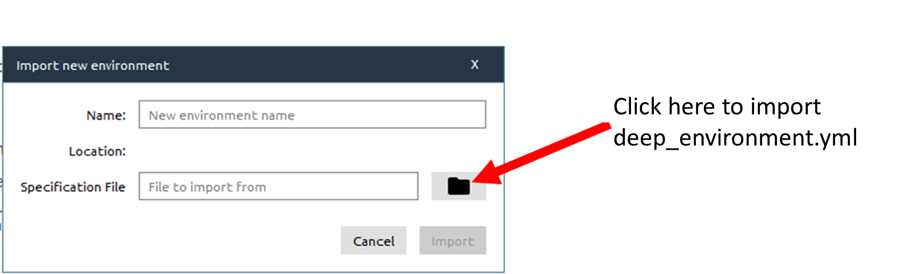
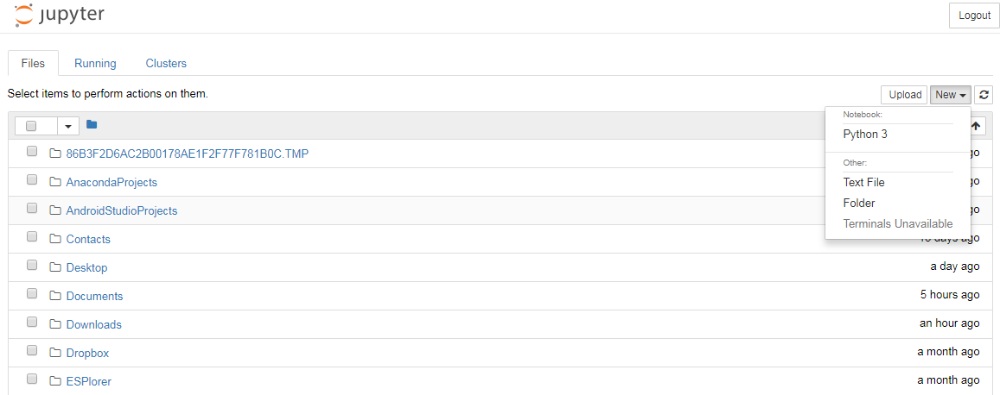

<h2 id="setup">Setup</h2>

  To participate in the workshop,
  you will need access to the software described below.
  In addition, you will need an up-to-date web browser.
  You will need a PC with 64-bit CPU, since several packages we will be using are only available for 64-bit.
  To check this, open a bash shell, type 
  

  
  ~~~
  uname -m
  ~~~
  {: .language-bash}
  
 
 
  If your system is 64-bit the answer should be `x86_64`. 

  We maintain a list of common issues that occur during installation as a reference for instructors
  that may be useful on the
  <a href = "{{site.swc_github}}/workshop-template/wiki/Configuration-Problems-and-Solutions">Configuration Problems and Solutions wiki page</a>.

- [Install the bash shell](#the-bash-shell)
- [Install a Text editor](#editor)
- [Install Python Anaconda](#install-python-anaconda)
- [Install Anaconda Navigator](#install-anaconda-navigator)
- [Install Additional python packages for the workshop](#additional-python-packages-for-the-workshop)

## The Bash Shell

  Start of 'shell' section. 

  

    Bash is a commonly-used shell that gives you the power to do simple
    tasks more quickly.
  

  

    

      <h4 id="shell-windows">Windows</h4>
      <a href="https://www.youtube.com/watch?v=339AEqk9c-8">Video Tutorial</a>
      <ol>
        <li>Download the Git for Windows <a href="https://git-for-windows.github.io/">installer</a>.</li>
        <li>Run the installer and follow the steps below:
          <ol>
             Git 2.18.0 Setup 
            <li>
                Click on "Next" four times (two times if you've previously
                installed Git).  You don't need to change anything
                in the Information, location, components, and start menu screens.
            </li>
            <li>
                <strong>
                Select “Use the nano editor by default” and click on “Next”.
                </strong>
            </li>
             Adjusting your PATH environment 
            <li>
                Keep "Use Git from the Windows Command Prompt" selected and click on "Next".
                If you forgot to do this programs that you need for the workshop will not work properly.
                If this happens rerun the installer and select the appropriate option.
            </li>
             Choosing the SSH executable 
            <li>Click on "Next".</li>
             Configuring the line ending conversions 
            <li>
                Keep "Checkout Windows-style, commit Unix-style line endings" selected and click on "Next".
            </li>
             Configuring the terminal emulator to use with Git Bash 
            <li>
              <strong>
                Select "Use Windows' default console window" and click on "Next".
              </strong>
            </li>
             Configuring experimental performance tweaks 
            <li>Click on "Install".</li>
             Installing 
             Completing the Git Setup Wizard 
            <li>Click on "Finish".</li>
          </ol>
        </li>
        <li>
          If your "HOME" environment variable is not set (or you don't know what this is):
          <ol>
            <li>Open command prompt (Open Start Menu then type <code>cmd</code> and press [Enter])</li>
            <li>
              Type the following line into the command prompt window exactly as shown:
              
<code>setx HOME "%USERPROFILE%"</code>

            </li>
            <li>Press [Enter], you should see <code>SUCCESS: Specified value was saved.</code></li>
            <li>Quit command prompt by typing <code>exit</code> then pressing [Enter]</li>
          </ol>
        </li>
      </ol>
      
This will provide you with both Git and Bash in the Git Bash program.

    

    

      <h4 id="shell-macosx">macOS</h4>
      

        The default shell in all versions of macOS is Bash, so no
        need to install anything.  You access Bash from the Terminal
        (found in
        <code>/Applications/Utilities</code>).
        See the Git installation <a href="https://www.youtube.com/watch?v=9LQhwETCdwY ">video tutorial</a>
        for an example on how to open the Terminal.
        You may want to keep
        Terminal in your dock for this workshop.
      

    

    

      <h4 id="shell-linux">Linux</h4>
      

        The default shell is usually Bash, but if your
        machine is set up differently you can run it by opening a
        terminal and typing <code>bash</code>.  There is no need to
        install anything.
      

    

  

  End of 'shell' section. 

## Text Editor

  Start of 'editor' section. 

  

    When you're writing code, it's nice to have a text editor that is
    optimized for writing code, with features like automatic
    color-coding of key words. The default text editor on macOS and
    Linux is usually set to Vim, which is not famous for being
    intuitive. If you accidentally find yourself stuck in it, hit
    the <kbd>Esc</kbd> key, followed by <kbd>:</kbd>+<kbd>Q</kbd>+<kbd>!</kbd> 
    (colon, lower-case 'q', exclamation mark), then hitting <kbd>Return</kbd> to 
    return to the shell.
  

  

    

      <h4 id="editor-windows">Windows</h4>
      

        nano is a basic editor and the default that instructors use in the workshop.
        It is installed along with Git.
      

      

        Others editors that you can use are
        <a href="https://notepad-plus-plus.org/">Notepad++</a> or
        <a href="https://www.sublimetext.com/">Sublime Text</a>.
        <strong>Be aware that you must
          add its installation directory to your system path.</strong>
        Please ask your instructor to help you do this.
      

    

    

      <h4 id="editor-macosx">macOS</h4>
      

        nano is a basic editor and the default that instructors use in the workshop.
        See the Git installation <a href="https://www.youtube.com/watch?v=9LQhwETCdwY ">video tutorial</a>
        for an example on how to open nano.
        It should be pre-installed.
      

      

        Others editors that you can use are
        <a href="https://www.barebones.com/products/bbedit/">BBEdit</a> or
        <a href="https://www.sublimetext.com/">Sublime Text</a>.
      

    

    

      <h4 id="editor-linux">Linux</h4>
      

        nano is a basic editor and the default that instructors use in the workshop.
        It should be pre-installed.
      

      

        Others editors that you can use are
        <a href="https://wiki.gnome.org/Apps/Gedit">Gedit</a>,
        <a href="https://kate-editor.org/">Kate</a> or
        <a href="https://www.sublimetext.com/">Sublime Text</a>.
      

    

  

  End of 'editor' section. 

## Python

  Start of 'Python' section. Remove the third paragraph if
           the workshop will teach Python using something other than
           the Jupyter notebook.
           Details at https://jupyter-notebook.readthedocs.io/en/stable/notebook.html#browser-compatibility 
  

  

    <a href="https://python.org">Python</a> is a popular language for
    research computing, and great for general-purpose programming as
    well.  Installing all of its research packages individually can be
    a bit difficult, so we recommend
    <a href="https://www.anaconda.com/distribution/">Anaconda</a>,
    an all-in-one installer.
  

    

      Regardless of how you choose to install it,
      <strong>please make sure you install Python version 3.x</strong>
      (e.g., 3.6 is fine).
    

    

      We will teach Python using the <a href="https://jupyter.org/">Jupyter notebook</a>,
      a programming environment that runs in a web browser. For this to work you will need a reasonably
      up-to-date browser. The current versions of the Chrome, Safari and
      Firefox browsers are all
      <a href="https://jupyter-notebook.readthedocs.io/en/stable/notebook.html#browser-compatibility">supported</a>
      (some older browsers, including Internet Explorer version 9
      and below, are not).
    

  

    

      <h4 id="python-windows">Windows</h4>
      <a href="https://www.youtube.com/watch?v=xxQ0mzZ8UvA">Video Tutorial</a>
      <ol>
        <li>Open <a href="https://www.anaconda.com/download/#windows">https://www.anaconda.com/download/#windows</a> with your web browser.</li>
        <li>Download the Python 3 installer for Windows.</li>
        <li>Install Python 3 using all of the defaults for installation <em>except</em> make sure to check <strong>Add Anaconda to my PATH environment variable</strong>.</li>
      </ol>
    

    

      <h4 id="python-macosx">macOS</h4>
      <a href="https://www.youtube.com/watch?v=TcSAln46u9U">Video Tutorial</a>
      <ol>
        <li>Open <a href="https://www.anaconda.com/download/#macos">https://www.anaconda.com/download/#macos</a> with your web browser.</li>
        <li>Download the Python 3 installer for OS X.</li>
        <li>Install Python 3 using all of the defaults for installation.</li>
      </ol>
    

    

      <h4 id="python-linux">Linux</h4>
      <ol>
        <li>Open <a href="https://www.anaconda.com/download/#linux">https://www.anaconda.com/download/#linux</a> with your web browser.</li>
        <li>Download the Python 3 installer for Linux. 
          (The installation requires using the shell. If you aren't
           comfortable doing the installation yourself
           stop here and request help at the workshop.)
        </li>
        <li>
          Open a terminal window.
        </li>
        <li>
          Type <pre>bash Anaconda3-</pre> and then press
          <kbd>Tab</kbd>. The name of the file you just downloaded should
          appear. If it does not, navigate to the folder where you
          downloaded the file, for example with:
          <pre>cd Downloads</pre>
          Then, try again.
        </li>
        <li>
          Press <kbd>Return</kbd>. You will follow the text-only prompts. To move through
          the text, press <kbd>Spacebar</kbd>. Type <code>yes</code> and
          press enter to approve the license. Press enter to approve the
          default location for the files. Type <code>yes</code> and
          press enter to prepend Anaconda to your <code>PATH</code>
          (this makes the Anaconda distribution the default Python).
        </li>
        <li>
          Close the terminal window.
        </li>
      </ol>
    

  


  

  Once you are done installing the software listed above,
  please go to <a href="setup/index.html">this page</a>,
  which has instructions on how to test that everything was installed correctly.
  



  End of 'Python' section. 

## Anaconda Navigator

One of the useful things about Anaconda Python is its tools for Python **package management** and **project environments**. The core tool for this is the command-line utility **conda**. However, there is also a GUI tool called "Anaconda Navigator".

As part of this workshop, we will learn how to use [Anaconda navigator](https://anaconda.org/anaconda/anaconda-navigator) to manage our Python environment and for this setup section, you only need to check Anaconda Navigator is available on your laptop. Do not hesitate to contact us if you have any problems. We will be able to help you with the installation during the workshop so do not worry!

### Test your Installation

Launch "Anaconda Navigator" from your menu. This should work on any operating system (Windows, Mac-OSX and Linux) and a window should pop up:

On Mac-OSX or Linux, you may want to launch it from the command line:

~~~
$ anaconda-navigator
~~~
{: .language-bash}

 

> ## Credits
> This installation tutorial is taken from [Software Carpentry](http://swcarpentry.github.io/workshop-template/#setup)
{: .callout}

###  Additional python packages for the workshop

We will be using **Anaconda Navigator** to install all the python packages we will be using for this 
lesson.

### Download <a href="https://raw.githubusercontent.com/NordicESMHub/deep_python/gh-pages/files/deep_environment.yml">deep_environment.yml</a> to your local computer

- Right click on the following link  <a href="https://raw.githubusercontent.com/NordicESMHub/deep_python/gh-pages/files/deep_environment.yml">deep_environment.yml</a> and "save as link" it to your local computer
- Make sure you know where you saved it! (Check your "Downloads" folder).

### Start Anaconda navigator

#### WINDOWS

After you install Anaconda on Windows, start Navigator by:

Clicking the Anaconda Navigator desktop app from the start menu. Or by opening an Anaconda Prompt from the start menu and running the command anaconda-navigator.

#### MacOS

After you install Anaconda on macOS, start Navigator by:

Clicking the Navigator menu item that was automatically added to your menu.

Or open Launchpad, click Terminal or iTerm and enter the command anaconda-navigator.

~~~
$ anaconda-navigator
~~~
{: .language-bash}

#### Linux

After you install Anaconda on Linux, you can start Anaconda Navigator by opening a Terminal window and running the command "anaconda-navigator":

~~~
$ anaconda-navigator
~~~
{: .language-bash}

Anaconda does not add shortcuts for Linux automatically because different Linux distributions have 
different systems for adding menu or desktop shortcuts. You can use your operating system to create 
desktop and/or main-menu shortcuts that run the command anaconda-navigator.

For more information on how to start Anaconda Navigator look [here](https://docs.continuum.io/anaconda/navigator/getting-started).

### Create a new conda environment "deeplearning"

#### From the command line (Mac OSX and Linux)

Open a Terminal and type:
~~~
conda env create -f deep_environment.yml

source activate deep_python

jupyter notebook
~~~
{: .language-bash}

#### From `Anaconda Navigator`

- Click on tab "Environments" (menu on the left hand side) and then "Import"

- Click on the "Folder" icon and browse your file to select **deep_environment.yml**.

- Click on "Import". This stage may take a few minutes so be patient...

### Start jupyter notebook

We want to start a new jupyter notebook using our newly created conda environment. 
To select "deeplearning" conda environment:

- Click on "Home" (left menu)
- Select "deeplearning" in "Applications on"
- Launch jupyter notebook ("Launch" button)

Jupyter starts in your default browser at the address [http://localhost:8888/tree](http://localhost:8888/tree) and shows the tree (directories) from the root directory (here is root directory is to be understood from the installation location of Anaconda). It may vary from one laptop to another but you should not worry about it.

When clicking on "New" (right hand side) as shown on the Figure below:

 You should be able to select "Python 3". That's all you need for the workshop!

> ## Default browser
>  You may need to change the default browser for starting your jupyter notebook. All the examples in this lesson have been tested with [Google chrome](https://www.google.com/chrome/browser/desktop/index.html?brand=CHBD&gclid=CjwKCAiA15vTBRAHEiwA7Snfc8Ly7Kz3VH-sKSABkCHsiAhviP1ZJzyzV5wUPasjHs27d_0PcESFkhoCOskQAvD_BwE)
{: .callout}


